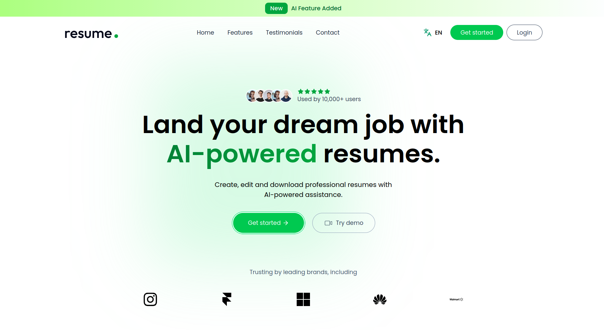

<div align="center">
  

  # Resume Builder - Client

  ### Create, edit and download professional resumes with AI-powered assistance

  [](https://reactjs.org/)
  [](https://vitejs.dev/)
  [](https://tailwindcss.com/)
  [](https://redux-toolkit.js.org/)

  
</div>

---

## Table of Contents

- [Features](#features)
- [Tech Stack](#tech-stack)
- [Getting Started](#getting-started)
- [Development Commands](#development-commands)
- [Project Structure](#project-structure)
- [Environment Variables](#environment-variables)
- [Key Features](#key-features)
- [Architecture](#architecture)

---

## Features

- **AI-Powered Content Generation** - Generate professional resume content with AI assistance
- **Multiple Templates** - Choose from Classic, Modern, Minimal, and Minimal Image templates
- **Customizable Colors** - Personalize your resume with accent color customization
- **Multi-language Support** - Built-in internationalization (i18next)
- **Annexe Management** - Attach and manage files (certificates, portfolios) with ImageKit integration
- **Public/Private Resumes** - Share your resume with custom URL slugs or keep it private
- **Responsive Design** - Mobile-friendly interface built with TailwindCSS
- **Real-time Preview** - See your changes instantly
- **PDF Export** - Download your resume as PDF
- **Authentication** - Secure JWT-based authentication

---

## Tech Stack

| Category | Technologies |
|----------|-------------|
| **Framework** | React 18.3.1 + Vite 6.0.5 |
| **State Management** | Redux Toolkit 2.5.0 |
| **Styling** | TailwindCSS 3.4.17 |
| **Routing** | React Router DOM 7.1.3 |
| **HTTP Client** | Axios 1.7.9 |
| **Internationalization** | i18next + react-i18next |
| **Icons** | Iconsax React, Phosphor Icons, Iconify |
| **PDF Generation** | html2pdf.js |
| **Notifications** | React Hot Toast |

---

## Getting Started

### Prerequisites

- Node.js (v16 or higher)
- npm or yarn
- Backend server running (see server README)

### Installation

1. Clone the repository
```bash
git clone <repository-url>
cd resume-builder/client
```

2. Install dependencies
```bash
npm install
```

3. Configure environment variables
```bash
cp .env.example .env
```
Edit `.env` and set `VITE_BASE_URL` to your backend API URL.

4. Start the development server
```bash
npm run dev
```

The application will be available at `http://localhost:5173`

---

## Development Commands

| Command | Description |
|---------|-------------|
| `npm run dev` | Start development server with HMR |
| `npm run build` | Build for production |
| `npm run preview` | Preview production build locally |
| `npm run lint` | Run ESLint for code quality |

---

## Project Structure

```
client/
├── public/              # Static assets
│   ├── favicon.ico      # Application logo
│   └── screenshot.png   # Application screenshot
├── src/
│   ├── app/            # Redux store configuration
│   │   ├── store.js
│   │   └── features/
│   │       └── authSlice.js
│   ├── assets/         # Images, fonts, etc.
│   ├── components/     # Reusable UI components
│   │   ├── templates/  # Resume templates
│   │   ├── home/       # Landing page sections
│   │   └── ...         # Form components, UI components
│   ├── configs/        # Configuration files
│   │   └── api.js      # Axios instance
│   ├── pages/          # Page components
│   │   ├── Home.jsx
│   │   ├── Login.jsx
│   │   ├── Dashboard.jsx
│   │   ├── ResumeBuilder.jsx
│   │   ├── Preview.jsx
│   │   └── PreviewFinal.jsx
│   ├── i18n.js         # Internationalization config
│   ├── App.jsx         # Main routing component
│   └── main.jsx        # Application entry point
├── .env                # Environment variables
├── vite.config.js      # Vite configuration
├── tailwind.config.js  # TailwindCSS configuration
└── package.json        # Dependencies and scripts
```

---

## Environment Variables

Create a `.env` file in the client directory:

```env
VITE_BASE_URL=http://localhost:3000
```

| Variable | Description | Required |
|----------|-------------|----------|
| `VITE_BASE_URL` | Backend API endpoint | Yes |

---

## Key Features

### Resume Templates

- **Classic Template** - Traditional professional layout
- **Modern Template** - Contemporary design with accent colors
- **Minimal Template** - Clean and simple layout
- **Minimal Image Template** - Minimal design with profile image support

### Resume Sections

- Personal Information
- Professional Summary
- Work Experience
- Education
- Projects
- Skills
- Publications
- Languages
- Signature
- Annexes (File attachments)

### Authentication Flow

1. JWT tokens stored in `localStorage`
2. On app load, `App.jsx` fetches user data if token exists
3. `authSlice` manages authentication state (token, user, loading)
4. Token passed in `Authorization` header for protected API calls

---

## Architecture

### State Management

Redux Toolkit is used for global state management:
- `authSlice` - Authentication state (user, token, loading)
- Async thunks for API calls
- Persistent state via localStorage

### Routing

React Router DOM handles navigation:
- Public routes: `/`, `/login`, `/preview/:slug`
- Protected routes: `/app/dashboard`, `/app/resume/:id`, `/app/preview-final/:id`

### API Integration

Axios instance configured in `src/configs/api.js`:
- Base URL from environment variable
- Automatic token injection for authenticated requests
- Request/response interceptors

### Internationalization

i18next configuration:
- Language switching support
- Translation files for multiple languages
- Language selector component

---

## Contributing

1. Fork the repository
2. Create your feature branch (`git checkout -b feat/amazing-feature`)
3. Commit your changes following conventional commits
4. Push to the branch (`git push origin feat/amazing-feature`)
5. Open a Pull Request

---

## License

This project is licensed under the MIT License.